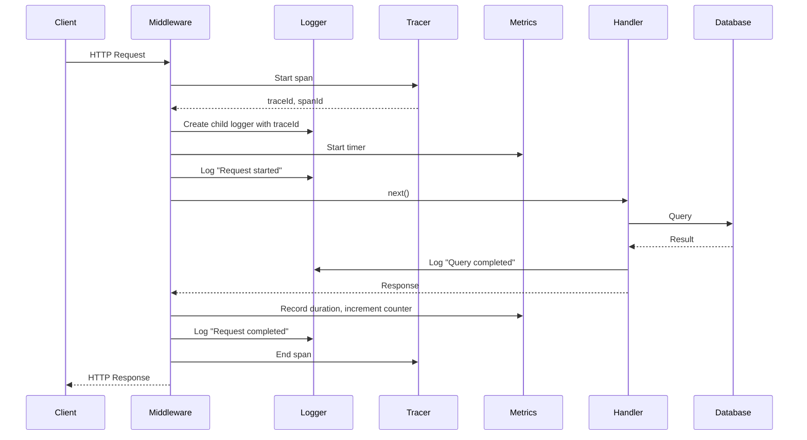

# Infrastructure Integration Guide

---
**Last Updated**: 2026-01-28  
**Status**: 💡 GUIDANCE  
**Maintainer**: Infrastructure Team  
---

## Purpose

This guide shows how different infrastructure components work together. Infrastructure is a **system**, not isolated pieces.

---

## Quick Navigation

- [Observability Stack Integration](#observability-stack-integration)
- [Environment-Specific Configurations](#environment-specific-configurations)
- [Request Lifecycle](#request-lifecycle)
- [Error Handling Flow](#error-handling-flow)
- [Deployment Integration](#deployment-integration)

---

## Observability Stack Integration

### The Three Pillars Working Together

```typescript
// src/middleware/observability.ts
import { logger } from './logger';
import { tracer } from './tracing';
import { httpRequestsTotal, httpRequestDuration } from './metrics';

export function observabilityMiddleware(req, res, next) {
  // 1. START TRACE
  const span = tracer.startSpan('http.request', {
    attributes: {
      'http.method': req.method,
      'http.url': req.url,
      'http.user_agent': req.headers['user-agent']
    }
  });
  
  const traceId = span.spanContext().traceId;
  const spanId = span.spanContext().spanId;
  
  // 2. ATTACH TRACE CONTEXT TO LOGGER
  req.log = logger.child({
    traceId,
    spanId,
    requestId: req.id
  });
  
  req.log.info('Request started', {
    method: req.method,
    path: req.path,
    ip: req.ip
  });
  
  // 3. TRACK METRICS
  const start = Date.now();
  
  res.on('finish', () => {
    const duration = (Date.now() - start) / 1000;
    const status = res.statusCode.toString();
    
    // Increment request counter
    httpRequestsTotal.inc({
      method: req.method,
      route: req.route?.path || req.path,
      status
    });
    
    // Record request duration
    httpRequestDuration.observe(
      {
        method: req.method,
        route: req.route?.path || req.path,
        status
      },
      duration
    );
    
    // Add metrics to trace
    span.setAttributes({
      'http.status_code': res.statusCode,
      'http.response_time_ms': duration * 1000
    });
    
    // Log completion with trace context
    req.log.info('Request completed', {
      status: res.statusCode,
      duration,
      traceId,  // Links logs to traces in observability platform
      spanId
    });
    
    // End trace
    span.end();
  });
  
  next();
}
```

### How It Works

1. **Trace starts** → Generates `traceId` and `spanId`
2. **Logger gets trace context** → All logs include `traceId`
3. **Metrics recorded** → Request counted, duration measured
4. **Trace ends** → Span sent to OpenTelemetry collector

### Benefits

- **Logs → Traces**: Click `traceId` in logs to see full request trace
- **Traces → Logs**: See all logs for a specific trace
- **Metrics → Traces**: High latency alert → Find slow traces → See logs
- **Unified debugging**: One request ID across all systems

---

## Environment-Specific Configurations

### Configuration Matrix

| Feature | Development | Staging | Production |
|---------|------------|---------|------------|
| **Log Level** | `debug` | `info` | `info` |
| **Log to File** | ❌ No | ✅ Yes | ✅ Yes |
| **Log to Console** | ✅ Yes | ✅ Yes | ❌ No |
| **Metrics Enabled** | ❌ No | ✅ Yes | ✅ Yes |
| **Metrics Scrape Interval** | - | 15s | 10s |
| **Tracing Enabled** | ❌ No | ✅ Yes | ✅ Yes |
| **Trace Sample Rate** | 100% | 50% | 10% |
| **Graceful Shutdown Timeout** | 5s | 30s | 30s |
| **Database Pool Size** | 5 | 20 | 50 |
| **Request Timeout** | 30s | 30s | 10s |
| **Alert Thresholds** | Disabled | 2x prod | Strict |

### Implementation

```typescript
// config/environment.ts
import { z } from 'zod';

const envSchema = z.object({
  NODE_ENV: z.enum(['development', 'staging', 'production', 'test']),
  LOG_LEVEL: z.enum(['trace', 'debug', 'info', 'warn', 'error']),
  LOG_TO_FILE: z.coerce.boolean(),
  LOG_TO_CONSOLE: z.coerce.boolean(),
  METRICS_ENABLED: z.coerce.boolean(),
  METRICS_SCRAPE_INTERVAL_MS: z.coerce.number().optional(),
  TRACING_ENABLED: z.coerce.boolean(),
  TRACING_SAMPLE_RATE: z.coerce.number().min(0).max(1),
  SHUTDOWN_TIMEOUT_MS: z.coerce.number(),
  DATABASE_POOL_MIN: z.coerce.number(),
  DATABASE_POOL_MAX: z.coerce.number(),
  REQUEST_TIMEOUT_MS: z.coerce.number()
});

export const config = envSchema.parse(process.env);

// Environment-specific defaults
export const environmentDefaults = {
  development: {
    LOG_LEVEL: 'debug',
    LOG_TO_FILE: false,
    LOG_TO_CONSOLE: true,
    METRICS_ENABLED: false,
    TRACING_ENABLED: false,
    TRACING_SAMPLE_RATE: 1.0,
    SHUTDOWN_TIMEOUT_MS: 5000,
    DATABASE_POOL_MIN: 2,
    DATABASE_POOL_MAX: 5,
    REQUEST_TIMEOUT_MS: 30000
  },
  staging: {
    LOG_LEVEL: 'info',
    LOG_TO_FILE: true,
    LOG_TO_CONSOLE: true,
    METRICS_ENABLED: true,
    METRICS_SCRAPE_INTERVAL_MS: 15000,
    TRACING_ENABLED: true,
    TRACING_SAMPLE_RATE: 0.5,
    SHUTDOWN_TIMEOUT_MS: 30000,
    DATABASE_POOL_MIN: 5,
    DATABASE_POOL_MAX: 20,
    REQUEST_TIMEOUT_MS: 30000
  },
  production: {
    LOG_LEVEL: 'info',
    LOG_TO_FILE: true,
    LOG_TO_CONSOLE: false,
    METRICS_ENABLED: true,
    METRICS_SCRAPE_INTERVAL_MS: 10000,
    TRACING_ENABLED: true,
    TRACING_SAMPLE_RATE: 0.1,
    SHUTDOWN_TIMEOUT_MS: 30000,
    DATABASE_POOL_MIN: 10,
    DATABASE_POOL_MAX: 50,
    REQUEST_TIMEOUT_MS: 10000
  }
};
```

---

## Request Lifecycle

### Complete Flow with All Infrastructure



### Code Example

```typescript
// Full request lifecycle
app.use(observabilityMiddleware);  // Adds logging, tracing, metrics

app.get('/users/:id', async (req, res) => {
  // Logger already has traceId from middleware
  req.log.debug('Fetching user', { userId: req.params.id });
  
  try {
    // Database query (automatically traced if using instrumented library)
    const user = await db('users').where({ id: req.params.id }).first();
    
    if (!user) {
      req.log.warn('User not found', { userId: req.params.id });
      return res.status(404).json({ error: 'User not found' });
    }
    
    req.log.info('User fetched successfully', { userId: user.id });
    res.json(user);
    
  } catch (error) {
    req.log.error('Database error', {
      error: error.message,
      stack: error.stack,
      userId: req.params.id
    });
    
    res.status(500).json({ error: 'Internal server error' });
  }
});

// Middleware automatically:
// - Records metrics (request count, duration)
// - Logs request completion
// - Ends trace span
```

---

## Error Handling Flow

### Integrated Error Handling

```typescript
// src/middleware/error-handler.ts
import { logger } from './logger';
import { httpErrorsTotal } from './metrics';
import { tracer } from './tracing';

export function errorHandler(err, req, res, next) {
  // 1. Get trace context
  const span = tracer.getActiveSpan();
  const traceId = span?.spanContext().traceId;
  
  // 2. Categorize error
  const isClientError = err.statusCode >= 400 && err.statusCode < 500;
  const isServerError = err.statusCode >= 500;
  
  // 3. Log error with trace context
  const logLevel = isClientError ? 'warn' : 'error';
  req.log[logLevel]('Request error', {
    error: err.message,
    stack: isServerError ? err.stack : undefined,
    statusCode: err.statusCode || 500,
    traceId
  });
  
  // 4. Record error metric
  httpErrorsTotal.inc({
    method: req.method,
    route: req.route?.path || req.path,
    status: (err.statusCode || 500).toString()
  });
  
  // 5. Add error to trace
  if (span) {
    span.recordException(err);
    span.setStatus({ code: 2, message: err.message });  // ERROR
  }
  
  // 6. Send response
  res.status(err.statusCode || 500).json({
    error: {
      message: isClientError ? err.message : 'Internal server error',
      requestId: req.id,
      traceId  // Include traceId for debugging
    }
  });
}
```

### Error Investigation Workflow

1. **Alert fires**: "Error rate > 5%"
2. **Check Grafana**: See which endpoint has errors
3. **Query logs**: Filter by endpoint and error status
4. **Find traceId**: Get traceId from error log
5. **View trace**: See full request flow in tracing UI
6. **Identify cause**: Trace shows which service/database call failed
7. **Fix and deploy**: Use CI/CD pipeline

---

## Deployment Integration

### CI/CD + Versioning + Monitoring

```yaml
# .github/workflows/deploy.yml
name: Deploy to Production

on:
  push:
    tags:
      - 'v*'

jobs:
  deploy:
    runs-on: ubuntu-latest
    steps:
      # 1. Build with version info
      - name: Build
        run: |
          export VERSION=${GITHUB_REF#refs/tags/v}
          export GIT_COMMIT=${GITHUB_SHA}
          export BUILD_DATE=$(date -u +"%Y-%m-%dT%H:%M:%SZ")
          npm run build
        
      # 2. Deploy
      - name: Deploy
        run: ./scripts/deploy.sh production
      
      # 3. Wait for health check
      - name: Health Check
        run: |
          sleep 10
          curl -f https://api.myapp.com/health || exit 1
      
      # 4. Verify metrics endpoint
      - name: Verify Metrics
        run: |
          curl -f https://api.myapp.com/metrics || exit 1
      
      # 5. Annotate Grafana dashboard
      - name: Annotate Deployment
        run: |
          curl -X POST https://grafana.myapp.com/api/annotations \
            -H "Authorization: Bearer $GRAFANA_TOKEN" \
            -d '{
              "text": "Deployed v$VERSION",
              "tags": ["deployment", "production"],
              "time": '$(date +%s000)'
            }'
```

### Post-Deployment Monitoring

```typescript
// src/server.ts
import { VERSION } from './version';
import { logger } from './logger';
import { deploymentGauge } from './metrics';

// Log deployment on startup
logger.info('Application deployed', {
  version: VERSION.version,
  gitCommit: VERSION.gitCommit,
  buildDate: VERSION.buildDate,
  environment: process.env.NODE_ENV
});

// Set deployment metric (for Grafana annotations)
deploymentGauge.set({
  version: VERSION.version,
  environment: process.env.NODE_ENV
}, Date.now());
```

---

## Best Practices

### 1. Always Use Structured Logging
```typescript
// ❌ Bad
console.log('User logged in');

// ✅ Good
logger.info('User logged in', {
  userId: user.id,
  email: user.email,
  traceId: req.traceId
});
```

### 2. Include Trace Context Everywhere
```typescript
// ❌ Bad
logger.error('Database error', { error: err.message });

// ✅ Good
logger.error('Database error', {
  error: err.message,
  traceId: req.traceId,  // Links to trace
  spanId: req.spanId,
  userId: req.user?.id
});
```

### 3. Metrics for Everything Important
```typescript
// Track business metrics, not just technical metrics
userSignupsTotal.inc({ source: 'web' });
paymentAmount.inc(payment.amount);
activeUsers.set(await getActiveUserCount());
```

### 4. Environment-Specific Behavior
```typescript
// Different behavior per environment
if (config.NODE_ENV === 'production') {
  // Strict validation, low trace sampling
} else if (config.NODE_ENV === 'development') {
  // Relaxed validation, full trace sampling
}
```

---

## Troubleshooting Integration Issues

### Logs Missing Trace IDs
**Symptom**: Logs don't have `traceId` field  
**Cause**: Observability middleware not applied  
**Fix**: Ensure `app.use(observabilityMiddleware)` is before routes

### Metrics Not Updating
**Symptom**: `/metrics` endpoint shows stale data  
**Cause**: Metrics not being recorded  
**Fix**: Check middleware order, verify metrics code is executed

### Traces Not Appearing
**Symptom**: No traces in tracing UI  
**Cause**: OpenTelemetry not configured or sampling rate too low  
**Fix**: Check `TRACING_ENABLED=true` and `TRACING_SAMPLE_RATE`

---

## See Also

- [LOGGING.md](LOGGING.md) - Structured logging details
- [prometheus.md](prometheus.md) - Metrics and monitoring
- [tracing.md](tracing.md) - Distributed tracing
- [environment-mode.md](environment-mode.md) - Environment configuration
- [CONFIGURATION.md](CONFIGURATION.md) - All configuration options
