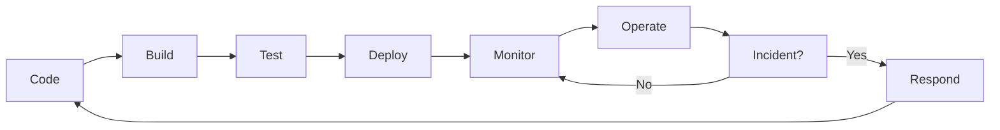

# DevOps Overview

---
**Last Updated**: 2026-01-28  
**Status**: 📋 Index Document  
**Maintainer**: Infrastructure Team  
---

## Purpose

This document serves as the **central index** for all DevOps-related documentation. It connects deployment, monitoring, operations, and incident response procedures.

---

## Quick Links

### 🚀 Deployment & CI/CD
- **[CI/CD Pipelines](cicd.md)** - GitHub Actions workflows, deployment strategies
- **[Program Versioning](program-versioning.md)** - Semantic versioning, changelog management
- **[Environment Management](environment-mode.md)** - Dev, staging, production configurations

### 📊 Monitoring & Observability
- **[Prometheus & Grafana](prometheus.md)** - Metrics collection, dashboards, alerts
- **[Logging](logging.md)** - Structured logging with Pino, log management
- **[Distributed Tracing](tracing.md)** - OpenTelemetry, request correlation

### 🛠️ Operations
- **[Graceful Shutdown](graceful-shutdown.md)** - Signal handling, resource cleanup
- **[Operational Runbooks](runbooks/)** - Incident response procedures *(coming soon)*
- **[MVP Documentation Plan](plan.md)** - Documentation priorities and templates

### 📋 Reference
- **[Implementation Status](implementation-status.md)** - What's actually implemented
- **[Configuration Reference](CONFIGURATION.md)** - All environment variables *(coming soon)*
- **[Integration Guide](integration-guide.md)** - How components work together *(coming soon)*

---

## DevOps Lifecycle



### 1. **Code & Build**
- Version control (Git)
- Semantic versioning
- Dependency management
- Build automation

**Documentation**: [Program Versioning](program-versioning.md)

### 2. **Test**
- Unit tests
- Integration tests
- E2E tests
- Security scans

**Documentation**: [CI/CD Pipelines](cicd.md#testing)

### 3. **Deploy**
- Staging deployment
- Production deployment
- Blue-green deployment
- Rollback procedures

**Documentation**: [CI/CD Pipelines](cicd.md#deployment)

### 4. **Monitor**
- Metrics collection (Prometheus)
- Log aggregation (Pino)
- Distributed tracing (OpenTelemetry)
- Dashboards (Grafana)

**Documentation**: [Prometheus](prometheus.md), [Logging](logging.md), [Tracing](tracing.md)

### 5. **Operate**
- Health checks
- Graceful shutdown
- Resource management
- Capacity planning

**Documentation**: [Graceful Shutdown](graceful-shutdown.md)

### 6. **Respond**
- Incident detection (alerts)
- Incident response (runbooks)
- Post-mortem analysis
- Continuous improvement

**Documentation**: [Runbooks](runbooks/) *(coming soon)*

---

## Common DevOps Tasks

### Deploy to Staging
```bash
# See: cicd.md for full workflow
git push origin develop
# GitHub Actions automatically deploys to staging
```

### Deploy to Production
```bash
# See: cicd.md for full workflow
git tag v1.2.3
git push origin v1.2.3
# GitHub Actions deploys after manual approval
```

### Check Application Health
```bash
# See: prometheus.md for metrics
curl http://localhost:3000/health
curl http://localhost:3000/metrics
```

### View Logs
```bash
# See: logging.md for details
tail -f logs/backend-current.log
# Or use log viewer
npm run logs:view
```

### Investigate Incident
```bash
# See: runbooks/ for detailed procedures
# 1. Check Grafana dashboards
# 2. Review recent logs
# 3. Check recent deployments
# 4. Follow incident-specific runbook
```

---

## On-Call Responsibilities

### Primary Responsibilities
1. **Monitor alerts** - Respond to Prometheus/Grafana alerts
2. **Investigate incidents** - Use runbooks to diagnose and resolve
3. **Communicate status** - Update stakeholders on incidents
4. **Document issues** - Create post-mortems for major incidents

### Escalation Path
1. **Level 1**: On-call engineer (you)
2. **Level 2**: Tech lead
3. **Level 3**: Engineering manager
4. **Level 4**: CTO

### Tools Access Required
- [ ] Grafana dashboard access
- [ ] Production server SSH access
- [ ] Database read access
- [ ] Log aggregation access
- [ ] PagerDuty/alerting system
- [ ] Incident communication channel (Slack)

---

## Key Metrics to Monitor

| Metric | Threshold | Alert Level | Runbook |
|--------|-----------|-------------|---------|
| **Error Rate** | > 5% | Critical | [high-error-rate.md](runbooks/high-error-rate.md) |
| **P95 Latency** | > 1s | Warning | [high-latency.md](runbooks/high-latency.md) |
| **CPU Usage** | > 80% | Warning | [high-resource-usage.md](runbooks/high-resource-usage.md) |
| **Memory Usage** | > 90% | Critical | [high-resource-usage.md](runbooks/high-resource-usage.md) |
| **DB Pool** | > 90% used | Warning | [database-errors.md](runbooks/database-errors.md) |
| **Disk Space** | > 85% | Warning | [disk-space.md](runbooks/disk-space.md) |

**See**: [Prometheus](prometheus.md) for full metrics list and alert rules

---

## Production Readiness Checklist

Before launching to production, verify:

### Infrastructure
- [ ] Graceful shutdown implemented
- [ ] Environment variables validated
- [ ] Database backups configured
- [ ] Monitoring and alerting set up
- [ ] Logging configured and tested

### Deployment
- [ ] CI/CD pipeline tested
- [ ] Rollback procedure documented
- [ ] Blue-green deployment configured
- [ ] Health check endpoints working

### Operations
- [ ] Runbooks created for common incidents
- [ ] On-call rotation established
- [ ] Escalation path defined
- [ ] Post-mortem template created

### Documentation
- [ ] All infrastructure docs up-to-date
- [ ] API documentation complete
- [ ] Configuration reference created
- [ ] Architecture diagrams current

**See**: [MVP Documentation Plan](plan.md) for detailed checklist

---

## Contributing to DevOps Docs

1. **Update implementation status** when features are implemented
2. **Create runbooks** for new incident types
3. **Document architecture decisions** in ADRs
4. **Keep metrics and alerts** in sync with code
5. **Review and update** quarterly

---

## Additional Resources

- [The Twelve-Factor App](https://12factor.net/)
- [Google SRE Book](https://sre.google/sre-book/table-of-contents/)
- [Prometheus Best Practices](https://prometheus.io/docs/practices/)
- [OpenTelemetry Documentation](https://opentelemetry.io/docs/)
